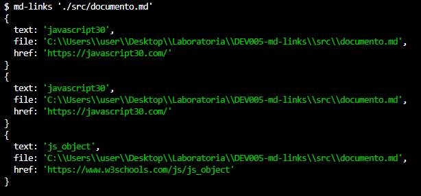
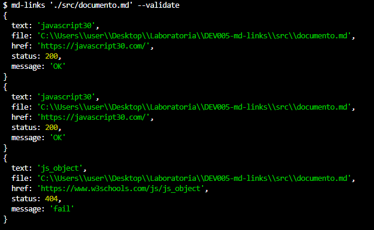
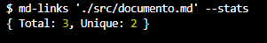
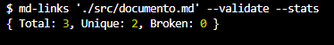
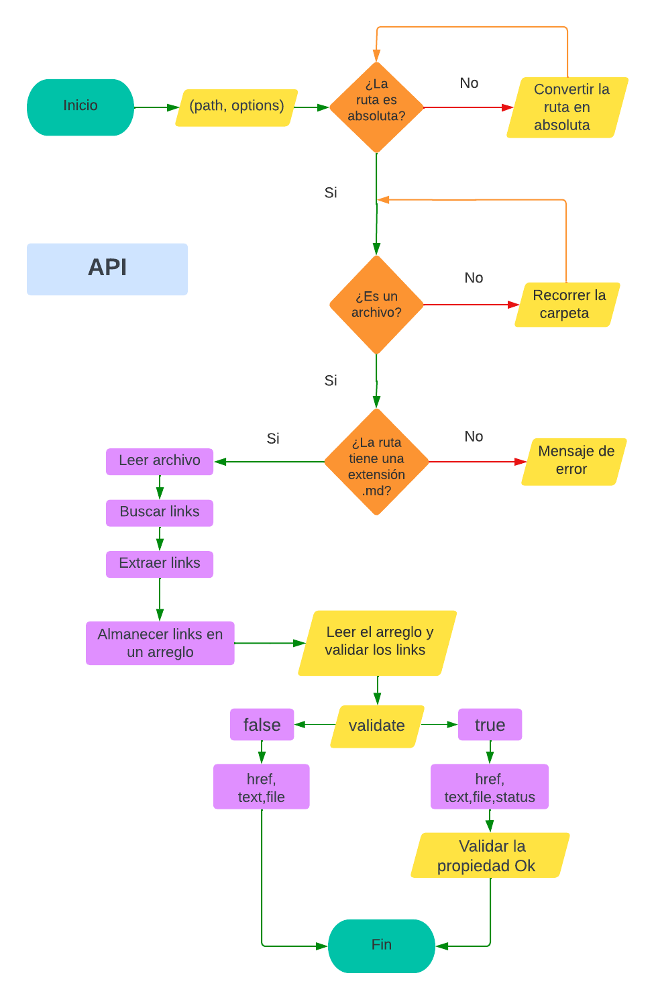
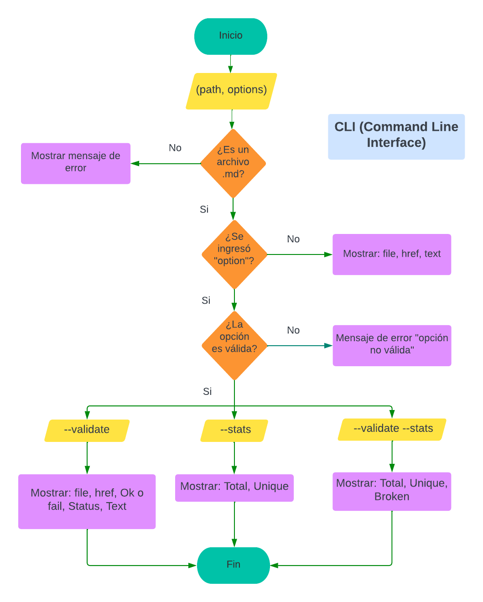

# Markdown Links

## Índice

- [Markdown Links](#markdown-links)
  - [Índice](#índice)
  - [1. Preámbulo](#1-preámbulo)
  - [2. Instalación](#2-instalación)
  - [3. Descripción del proyecto](#3-descripción-del-proyecto)
    - [Descripción de JavaScriptAPI](#descripción-de-javascriptapi)
    - [Ejemplo (resultados como comentarios)](#ejemplo-resultados-como-comentarios)
    - [CLI (Command Line Interface - Interfaz de Línea de Comando)](#cli-command-line-interface---interfaz-de-línea-de-comando)
      - [Options](#options)
        - [`--validate`](#--validate)
        - [`--stats`](#--stats)
        - [`--validate --stats`](#--validate---stats)
  - [4. Diagrama de flujo](#4-diagrama-de-flujo)
 
***

## 1. Preámbulo

[Markdown](https://es.wikipedia.org/wiki/Markdown) es un lenguaje de marcado
ligero my utilizado para presentar la descripción de algún proyecto. Comumente se presentan como `README.md` y normalmente contienen _links_ (vínculos/ligas) que
muchas veces están rotos o ya no son válidos y eso perjudica mucho el valor de
la información que se quiere compartir. 

A partir de ello se ha propuesto la creación una herramienta usando [Node.js](https://nodejs.org/), que lea y analice archivos en formato `Markdown`, para verificar los links que contengan y reportar cuantos links posee, cuantos son únicos y cuantos están rotos.

## 2. Instalación

Para instalar el módulo lo realizaremos mediante **npm**, para ello utilizaremos el siguiente comando: `npm i jg-mdlinks -g`.

## 3. Descripción del proyecto

Para poder usar el módulo es necesario importarlo usando require('jg-mdlinks')

### Descripción de JavaScriptAPI 

El JavaScriptAPI es una función que retorna una promesa `mdLinks(path, options)` que recibe dos parámetros: en primer lugar recibe un path(ruta absoluta o relativa) y options({validate: true} o {validate: false}) el cual retorna un array de objetos por cada link. Dependiendo de si validate fuera `true` o `false`.

Con `validate:false` :

* `href`: URL encontrada.
* `text`: Texto que aparecía dentro del link (`<a>`).
* `file`: Ruta del archivo donde se encontró el link.

Con `validate:true` :

* `href`: URL encontrada.
* `text`: Texto que aparecía dentro del link (`<a>`).
* `file`: Ruta del archivo donde se encontró el link.
* `status`: Código de respuesta HTTP.
* `ok`: Mensaje `fail` en caso de fallo u `ok` en caso de éxito.

### Ejemplo (resultados como comentarios)

```js
const mdLinks = require("md-links");

mdLinks("./some/example.md")
  .then(links => {
    // => [{ href, text, file }, ...]
  })
  .catch(console.error);

mdLinks("./some/example.md", { validate: true })
  .then(links => {
    // => [{ href, text, file, status, ok }, ...]
  })
  .catch(console.error);

mdLinks("./some/dir")
  .then(links => {
    // => [{ href, text, file }, ...]
  })
  .catch(console.error);
```

### CLI (Command Line Interface - Interfaz de Línea de Comando)

El ejecutable de nuestra aplicación debe poder ejecutarse de la siguiente
manera a través de la **terminal**: `md-links <path-to-file> [options]`

Como se observa el comando tiene dos argumentos `<path-to-file>` y `[options]`. El comportamiento por defecto, es decir colocando solo `<path-to-file>` nos permite identificar el archivo markdown (a partir de la ruta que recibe como argumento), analiza el archivo Markdown e imprime los links que vaya encontrando, junto con la ruta del archivo donde aparece y el texto
que hay dentro del link.

Por ejemplo:

```sh
$ md-links ./some/example.md
```




#### Options

##### `--validate`

Si pasamos la opción `--validate`, el módulo realiza una petición HTTP para
averiguar si el link funciona o no y nos devuelve el status y un mensaje que puede ser `ok` o `fail` 

```sh
$ md-links ./some/example.md --validate
```




##### `--stats`

Si pasamos la opción `--stats` el output (salida) será un texto con estadísticas
básicas sobre los links.

```sh
$ md-links ./some/example.md --stats
```



##### `--validate --stats`

También podemos combinar `--validate` y `--stats` para obtener estadísticas que
necesiten de los resultados de la validación.

```sh
$ md-links ./some/example.md --stats --validate
```



## 4. Diagrama de flujo

`JavaScript API`



`CLI (Command Line Interface)`




